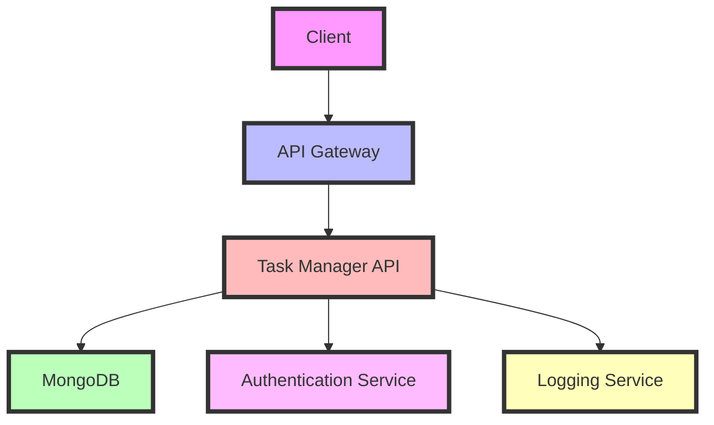
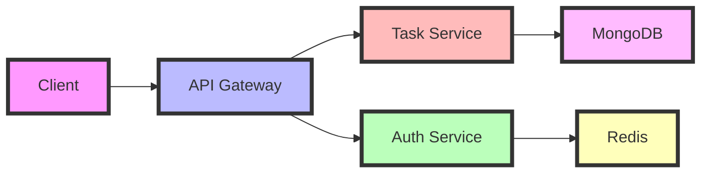

# Task Manager API 🚀

[](https://python.org)
[](https://flask.palletsprojects.com/)
[](https://www.mongodb.com/)
[](https://opensource.org/licenses/MIT)



A robust Flask-based Task Manager API with MongoDB integration, Docker containerization, and Jenkins CI/CD pipeline for automated deployment.

## 📋 Table of Contents

- [Features](#-features)
- [Architecture](#-architecture)
- [Project Structure](#-project-structure)
- [Setup & Installation](#-setup--installation)
- [Running with Docker](#-running-with-docker)
- [API Documentation](#-api-documentation)
- [Testing](#-testing)
- [CI/CD Pipeline](#-cicd-pipeline)
- [Deployment](#-deployment)
- [Contributing](#-contributing)
- [License](#-license)

## ✨ Features

- **CRUD Operations**: Full Create, Read, Update, Delete functionality for tasks
- **MongoDB Integration**: Scalable NoSQL database backend
- **Unit Testing**: Comprehensive test coverage with pytest
- **Docker Support**: Easy containerization and deployment
- **CI/CD Pipeline**: Automated testing and deployment with Jenkins
- **RESTful API**: Clean and well-documented endpoints
- **Scalable Architecture**: Designed for easy scaling and maintenance

## 🏛 Architecture

The Task Manager API follows a microservices architecture pattern with the following components:



## 🗂 Project Structure

```
task-manager-api/
├── .github/workflows/          # GitHub Actions workflows
├── api/                        # API endpoint definitions
├── config/                     # Configuration files
├── database/                   # Database models and migrations
├── docker/                     # Docker configuration
├── tests/                      # Unit and integration tests
├── utils/                      # Utility functions
├── .env.example                # Environment variables template
├── .gitignore                  # Git ignore rules
├── app.py                      # Main application entry point
├── Dockerfile                  # Docker build configuration
├── Jenkinsfile                 # Jenkins pipeline configuration
├── README.md                   # Project documentation
├── requirements.txt            # Python dependencies
└── setup.py                    # Package configuration
```

## 🛠 Setup & Installation

1. Clone the repository:

   ```bash
   git clone https://github.com/yourusername/task-manager-api.git
   cd task-manager-api
   ```

2. Create and activate virtual environment:

   ```bash
   python3 -m venv venv
   source venv/bin/activate
   ```

3. Install dependencies:

   ```bash
   pip install -r requirements.txt
   ```

4. Set up environment variables:

   ```bash
   cp .env.example .env
   # Edit .env with your configuration
   ```

5. Run database migrations:
   ```bash
   flask db upgrade
   ```

## 🐳 Running with Docker

1. Build the Docker image:

   ```bash
   docker-compose build
   ```

2. Start the services:

   ```bash
   docker-compose up
   ```

3. Access the API at:
   ```bash
   http://localhost:5000
   ```

## 📚 API Documentation

The API documentation is available at `/docs` endpoint when running the application. Key endpoints include:

- `GET /tasks` - List all tasks
- `POST /tasks` - Create new task
- `GET /tasks/{id}` - Get task details
- `PUT /tasks/{id}` - Update task
- `DELETE /tasks/{id}` - Delete task

## 🧪 Testing

Run tests with:

```bash
pytest tests/
```

## 🔄 CI/CD Pipeline

The Jenkins pipeline includes:

1. Code checkout
2. Dependency installation
3. Unit testing
4. Integration testing
5. Docker image build
6. Deployment to staging

## 🚀 Deployment

1. Build production image:

   ```bash
   docker-compose -f docker-compose.prod.yml build
   ```

2. Deploy to production:
   ```bash
   docker-compose -f docker-compose.prod.yml up -d
   ```

## 🤝 Contributing

1. Fork the repository
2. Create your feature branch
3. Commit your changes
4. Push to the branch
5. Create a new Pull Request

## 📄 License

This project is licensed under the MIT License - see the [LICENSE](LICENSE) file for details.
