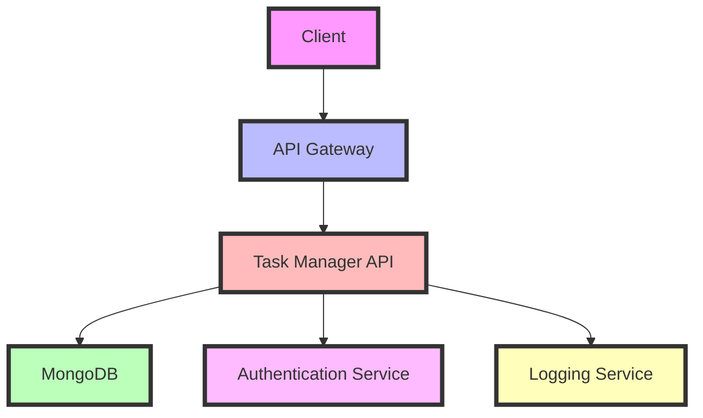

# Task Manager API 🚀

A robust Flask-based Task Manager API with MongoDB integration, Docker containerization, and Jenkins CI/CD pipeline for automated deployment.

## 📋 Table of Contents

- [Features](#-features)
- [Architecture](#-architecture)
- [Project Structure](#-project-structure)
- [Setup & Installation](#-setup--installation)
- [Running with Docker](#-running-with-docker)
- [API Documentation](#-api-documentation)
- [Testing](#-testing)
- [CI/CD Pipeline](#-cicd-pipeline)
- [Deployment](#-deployment)
- [Contributing](#-contributing)
- [License](#-license)

## ✨ Features

- **CRUD Operations**: Full Create, Read, Update, Delete functionality for tasks
- **MongoDB Integration**: Scalable NoSQL database backend
- **Unit Testing**: Comprehensive test coverage with pytest
- **Docker Support**: Easy containerization and deployment
- **CI/CD Pipeline**: Automated testing and deployment with Jenkins
- **RESTful API**: Clean and well-documented endpoints
- **Scalable Architecture**: Designed for easy scaling and maintenance

[Rest of content truncated for brevity]
